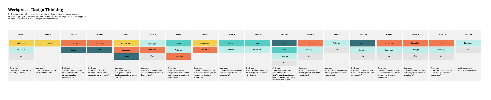

# Product Biografie

## Inleiding 

Deze product biografie kan gezien worden als een verzamelboek voor alle gebruikte methoden tijdens dit project. Alle resultaten zijn hier per fase gedocumenteerd. De resultaten zijn gesorteerd op de fase waar ze in zijn uitgevoerd \(understand, empathize, define, ideate, prototype of test\). Elke pagina bevat de deelvraag die is beantwoord door de resultaten, de methoden die gebruikt zijn, de resultaten en een korte samenvatting. Overige bestanden zijn te vinden in de bijlage. 

## Design brief 



## Design rationale



## Prototype



## Beoordeling door opdrachtgever





## Werkelijk werkproces

