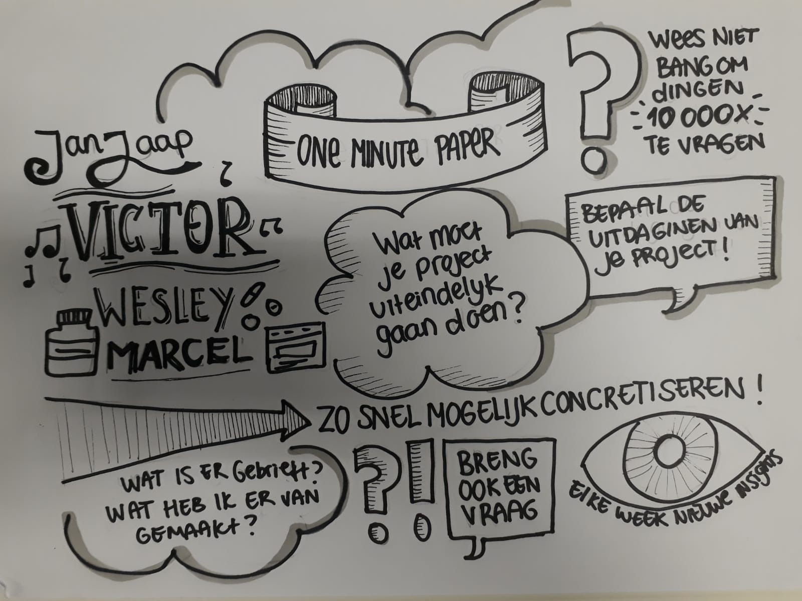
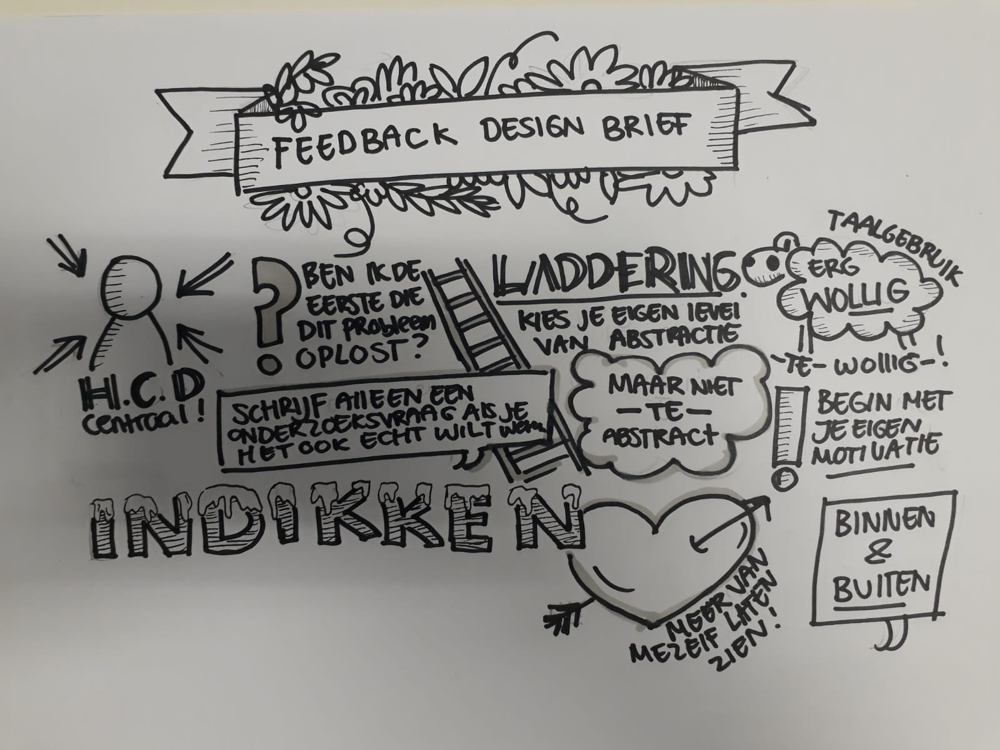

# Bijlagen

* feedback Jan Jaap
* recordings interviews
* reflectie Ryno
* reflectie Parisa

## Feedback Jan Jaap 



## Recordings interviews















## Reflectie Ryno

Gedurende het gehele afstudeerproject ben ik door mijn opdrachtgever \(van Gradient\) begeleid door 3 professionals. Hiervan heb ik 2 van die professionals gevraagd om te reflecteren op het project en mijn functioneren zodat ik misschien nog dingen kan verbeteren bij volgende grotere projecten. 

Ik heb voor beide een feedback formulier gemaakt die zij kunnen gebruiken bij hun reflectie. 



> Even though the topics were sometimes very difficult and unknown to you, you never shied away from taking them head on and doing the required research. I feel like we had quite unclear requirements in the beginning and a lot of stakeholders involved and you managed to keep your cool throughout.

> I think you’ve worked very hard to meet all the \(moving\) deadlines and always tried your best to please both school and Gradient, great work ethic! Linked to the feedback above, you could be a bit more assertive in meetings \(e.g. planning/asking for our time\). You always had the meetings prepared with a nice update and I think to make it even better, also think more about what YOU want out of the meeting, be a bit more selfish!

## Reflectie Parisa



