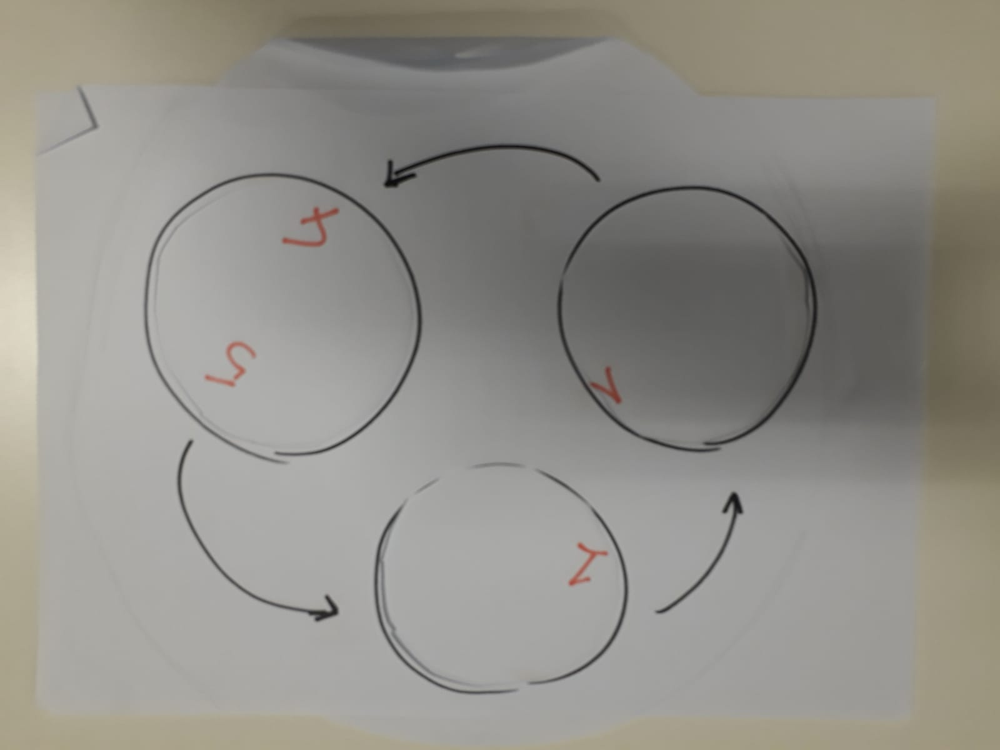
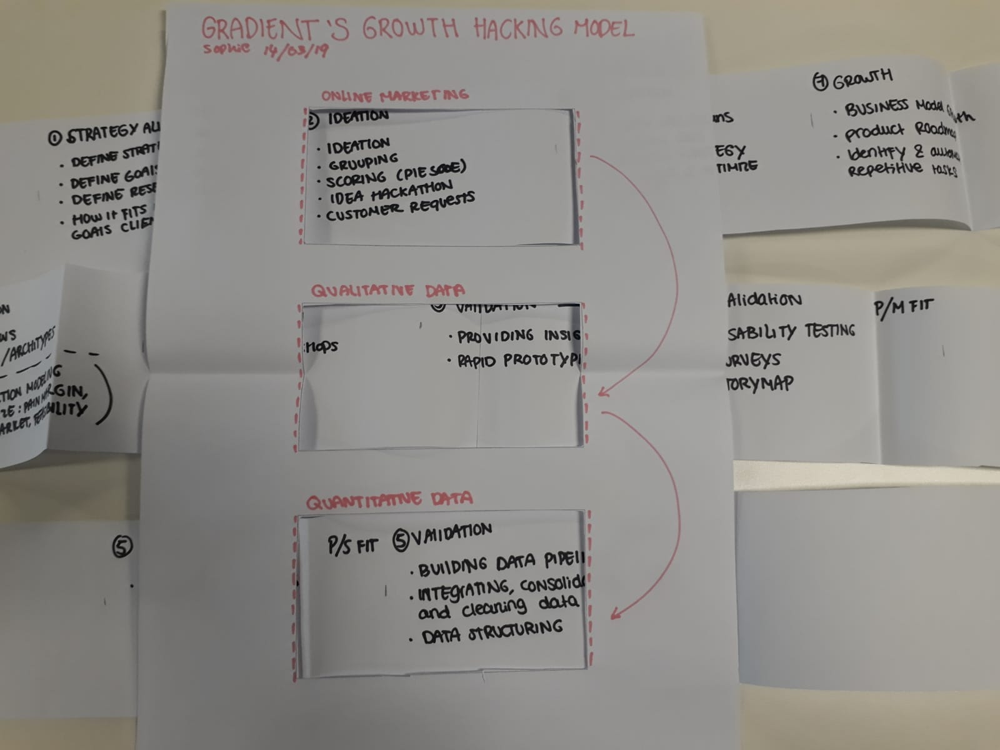
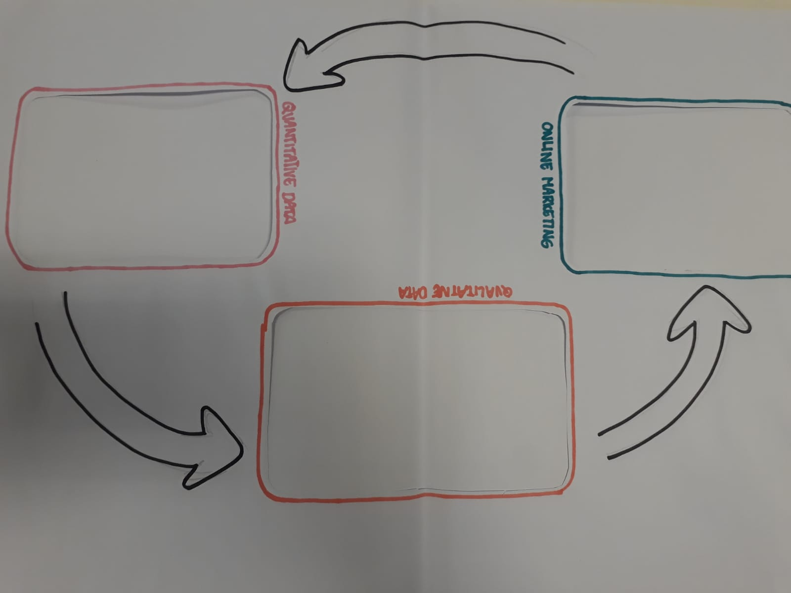
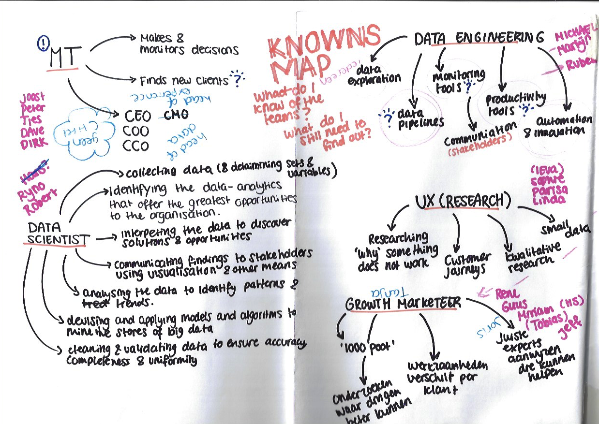
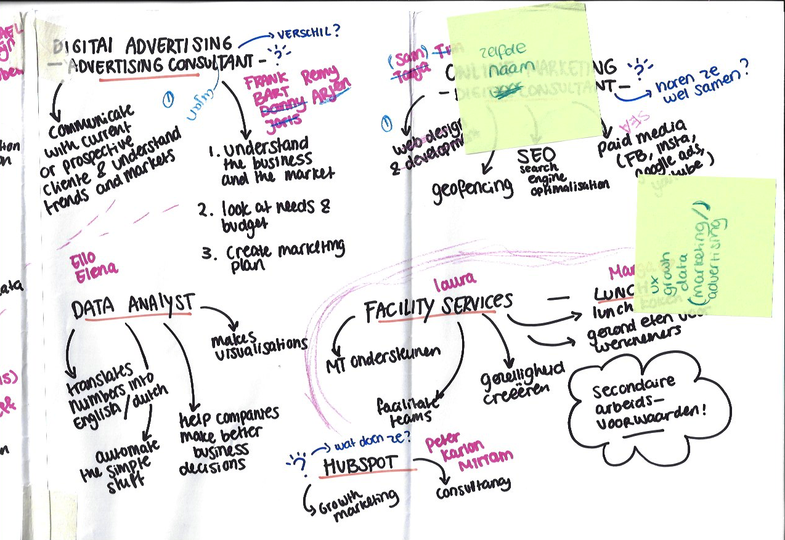

# Define

#### Onderzoeksvraag

5. Welke competenties heeft Gradient en hoe passen die in de propositie?

6. Hoe zien de interne werkprocessen er bij Gradient uit en hoe werken deze met elkaar samen?

## Methoden

* Prototyping
*  Desk research naar functies: data scientist, data engineer, data analyst, digital marketing consultant, digital advertising, internet marketeer, advertising consultant
* Visualisatie 2 
* Visualisatie 3
* Expert review \(Ties, Ryno, Parisa\)
* Participatory design \(Ryno\) 
* knowns map

## Prototyping 

Met de inzichten van de co-creation sessies ben ik gaan itereren en probeerde ik verschillende vormen te bedenken voor een eindoplossing. Hiervoor heb ik gebruik gemaakt van verschillende paper prototypes die ook interactief gebruikt konden worden. Ondanks dat ik nog lang niet genoeg informatie had om een volwaardig prototype te maken hielp het paper prototypen toch voor de inspiratie en kon ik verschillende oplossingsrichtingen verkennen. 

## Desk research 

Om meer begrip van de taken van ieder team te krijgen heb ik wat meer desk research gedaan naar de verschillende functies per team.

#### Wat doet een data scientist?

> Specific tasks include:
>
> * Identifying the data-analytics problems that offer the greatest opportunities to the organization
> * Determining the correct data sets and variables
> * Collecting large sets of structured and unstructured data from disparate sources
> * Cleaning and validating the data to ensure accuracy, completeness, and uniformity
> * Devising and applying models and algorithms to mine the stores of big data
> * Analyzing the data to identify patterns and trends
> * Interpreting the data to discover solutions and opportunities
> * Communicating findings to stakeholders using visualization and other means

Bron:   
What does a data scientist do? - University of Wisconsin - O’Neil, C., and Schutt, R. Doing Data Science. First edition. - uit 2013 - voor het laatst geraadpleegt op 06/03/2019 [https://datasciencedegree.wisconsin.edu/data-science/what-do-data-scientists-do/](https://datasciencedegree.wisconsin.edu/data-science/what-do-data-scientists-do/)

#### Wat doet een data engineer

> "Data engineers work quietly behind the scenes to make analytics possible. We usually need our data engineers to be quite savvy with several core technologies:

> * Data platforms - whether its relational databases, NoSQL, Hadoop, or Spark - depending on requirement the engineer needs to be able to provide the most applicable storage and access protocol.
> * ETL - workflow tools or programmatic libraries to extract data, move data around and transform them for ingestion into data platforms.
> * Connectors - probably the most important toolset - our engineer should know various ways of connecting to systems together to build pipelines - HTTP, REST, SOAP, ODBC, FTP - among a few. The data is all over the place, and it’s the engineer’s job to make the movement more efficient."

Bron: What does a data engineer do? Door [Sokratis Anastasiadis](https://www.quora.com/profile/Sokratis-Anastasiadis) op 29 juni 2018 - voor het laatst geraadpleegd op 06/03/2019 -  [https://www.quora.com/What-does-a-data-engineer-d](https://www.quora.com/What-does-a-data-engineer-do)

Bron: How To Become A Data Engineer: A Guide door [Yaniv Leven](https://blog.panoply.io/how-to-become-a-data-engineer-a-guide)  op 27 April 2017, voor het laatst geraadpleegd op 19/04/2019 -  [https://blog.panoply.io/how-to-become-a-data-engineer-a-guide](https://blog.panoply.io/how-to-become-a-data-engineer-a-guide)

#### Wat doet een data analyst?

> "Data analysts translate numbers into plain English Every business collects data, whether it's sales figures, market research, logistics, or transportation costs. A data analyst's job is to take that data and use it to help companies make better business decisions. This could mean figuring out how to price new materials for the market, how to reduce transportation costs, solve issues that cost the company money, or determine how many people should be working on Saturdays."

Data Analyst Job Description - door Snag uit 2010\(?\) - voor het laatst geraadpleegd op 06/03/2019 - [https://www.snagajob.com/job-descriptions/data-analyst/](https://www.snagajob.com/job-descriptions/data-analyst/)

#### Wat doet een marketing consultant?

> **Digital marketing** is an umbrella term that’s used to describe various forms of marketing that are done online.
>
> This includes, but is not limited to, Web Design and Development, Geofencing, search engine optimization \(also known as SEO\), and Paid Media such as Google Adwords, Facebook/Instagram advertising, and \(YouTube\) video advertising.

Bron: What does a digital marketing consultant do? - door Smek op 10 augustus 2018 - voor het laatst geraadpleegd op 06/03/2018 - [https://www.smekdigital.com/what-does-digital-marketing-consultant-do/](https://www.smekdigital.com/what-does-digital-marketing-consultant-do/)

#### Wat doet een advertising consultant?

> This form of advertising allows you to reach the right people with the right message at the right time. You may think you’re doing this already through newspapers, flyers, or radio ads. But as we explore digital campaigns together, you’ll see just how much digital is raising the bar in advertising.

Defining What is Digital Advertising and Why You Need It - door SHERMAN STANDBERRY op 8 Juli 2018 - voor het laatst geraadpleegd op 06/03/2019 [https://www.lyfemarketing.com/blog/what-is-digital-advertising/](https://www.lyfemarketing.com/blog/what-is-digital-advertising/)

#### Wat doet een internet marketeer?

> **An internet marketer measures and keeps track of everything.**
>
> Staying in the loop with your results allows you to decide whether your plans need some modifications or not. An internet marketer tracks everything—from the things people post about the company to the number of visitors that click through your site and stay within a reasonable length of time.

Bron: What does an internet marketer do? - door Gerard West op 11 April 2018 - voor het laatst geraadpleegd op 06/03/2019 - [https://www.quora.com/What-does-an-internet-marketer-do](https://www.quora.com/What-does-an-internet-marketer-do)

#### Wat doet een advertising consultant?

> An Advertising Consultant focuses on the way that businesses communicate with current or prospective clientele and is the person who understands trends and target markets. Businesses hire Advertising Consultants to use their expertise in evaluating their advertising efforts and suggesting improvements.

What does an Advertising Consultant do? - door Chegg Career Match in 2019 - voor het laatst geraadpleegd op 06/03/2019- [https://www.careermatch.com/job-prep/career-insights/profiles/advertising-consultant/](https://www.careermatch.com/job-prep/career-insights/profiles/advertising-consultant/)

## Visualisatie 2

Visualisatie 2 is een combinatie van mijn eerste visualisatie, en alle kennis die ik zover had opgedaan over de teams en de functies. Dit heb ik omgezet in een paper prototype die later is geëvalueerd door mijn opdrachtgever. 



## Participatory design

Na de tweede visualisatie heb ik een nieuwe iteratie daar op gemaakt samen met een van de opdrachtgevers uit de doelgroep. Hierbij hebben we samen de teams en skills van het bedrijf geplot op het tweede prototype. 

## Visualisatie 3

Deze derde visualisatie was mijn eerste poging richting een eindoplossing met alle kennis die ik tot zo ver kon toepassen. Ik heb hier feedback op gekregen door mijn opdrachtgever in een expert review.  









## Expert review

> Ik denk dat als we deze visualisatie laten zien aan klanten, dat ze dan niet het goede beeld krijgen van Gradient. Zo zie ik in dit prototype alleen maar funnels, terwijl het zo veel meer is! Ik twijfel zelfs of we die funnel wel nodig zouden hebben om onze propositie uit te leggen. - Ties

Overige feedback punten:

* er missen veel diensten en competenties van het bedrijf die in feite achter het papier zouden uitkomen \(na de funnel\)
* fases in de innovatie funnel kloppen wel
* dit geeft geen goed / correct beeld van de dagelijkse diensten en taken van de teams
* in een ideation kunnen ook ideeën van klanten naar voren komen die erg belangrijk zijn, maar die missen in de visualisatie 
* leg meer focus op de achterkant van de funnels
* zorg dat de belangrijkste dingen meer ruimte krijgen \(visueel\)
* zet het beeld van een funnel uit je hoofd
* maak een duidelijk startpunt 
* denk na over het element van tijd en abstractie 

## Knowns map

Na de feedback ben ik terug gaan denken aan de resultaten die ik al had onderzocht, en heb ik een overzicht gemaakt van de dingen die al weet en nog moet onderzoeken. Hieruit heb ik vervolgstappen kunnen plannen voor de volgende fases en prototypes.

