# Empathize

#### Onderzoeksvraag

2. Welke problemen ervaart het team van Gradient bij het uitvoeren van het nieuwe proces?

3. Hoe beschrijven de werknemers van Gradient de propositie van het bedrijf? 

 4. Hoe beschrijft het management team van Gradient de strategie van het bedrijf?

## Methoden

* interviews \(rene, ruben, ello, arjan, laura, miriam, elena\)
* co creation team \(ello, rene, tobias, elena\)
* co creation MT \(dirk & joost\)
* needs map
* persona mt
* persona medewerker
* persona klant

## Interviews

Ik ben het doelgroep onderzoek begonnen met interviews omdat ik graag een persoonlijk en gedetailed beeld wilde hebben van hoe de stakeholders het bedrijf zien. 

















## Co-Creation

Ik heb een co-creation sessie georganiseerd om meer inzichten te krijgen in hoe de werknemers denken over Gradient. Zo hebben we samen een overzicht gemaakt van alle diensten die het bedrijf aan biedt, de teams die het uitvoeren en we hebben gesproken over de werkprocessen. Tot slot hebben we een group discussion gedaan waar we hebben gesproken over de werksfeer, de dingen waar zij tegen aan lopen en wat zij denken dat beter kan. 





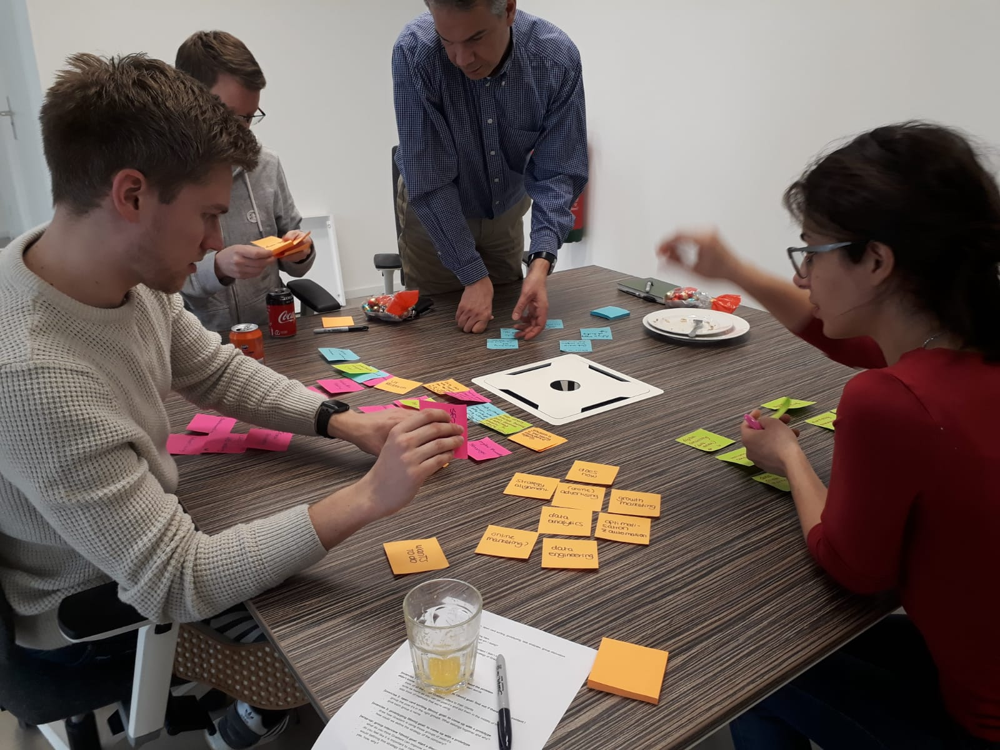









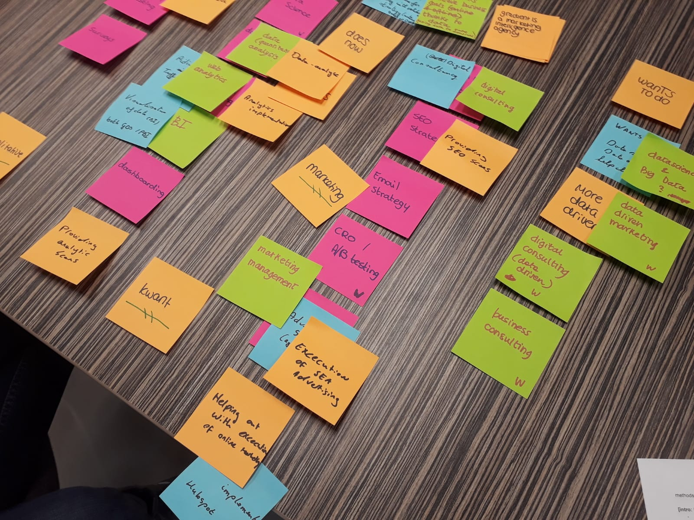

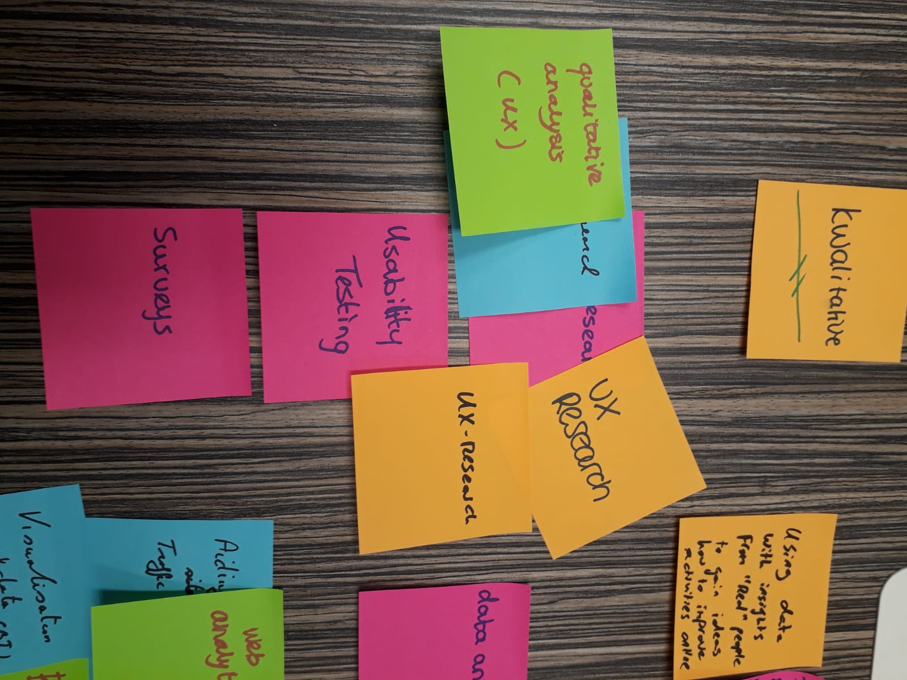

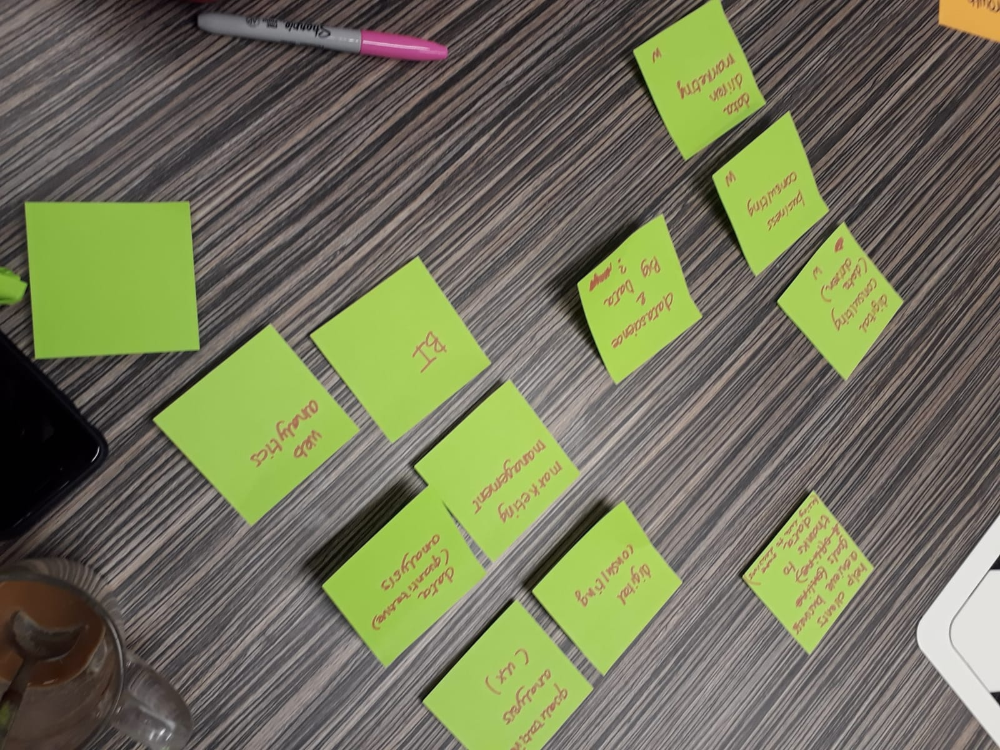

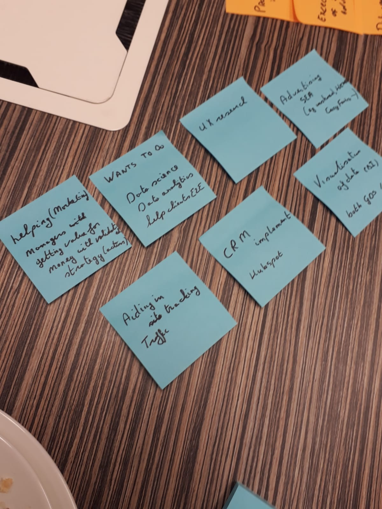

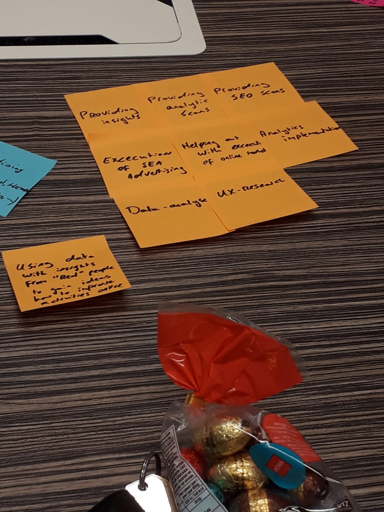

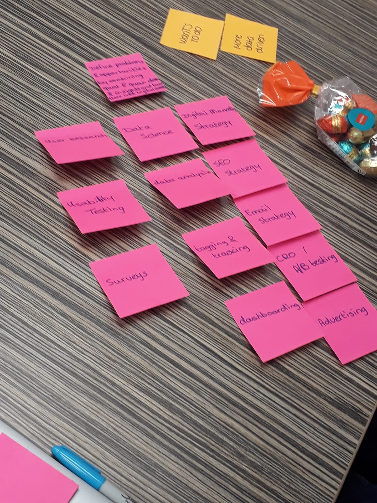



## Co-creation MT

Na de co-creation met het team heb ik er ook een georganiseerd met twee leden van het management team. In deze sessie hebben we gesproken over wat Gradient voor hen betekend en de geschiedenis en toekomst van het bedrijf. De belangrijkste punten gingen vooral over hoe Gradient is ontstaan, wat ze nu doen \(wat gaat er goed / wat kan er beter\) en waar zij Gradient over 5-10 jaar zouden zien. Als conclusie zou ik kunnen zeggen dat het management een heel ander beeld had van de propositie van het bedrijf dan dat de medewerkers hadden. Ook hun perceptie op de eindoplossing was anders dan dat de medewerkers hadden bedacht. 



## Needs map

Ik heb alle behoeftes van de doelgroep na aanleiding van de interviews en co-creation sessie samengevat in een needsmap. 



## Persona's

Om de verschillen tussen de stakeholders beter in beeld te krijgen heb ik voor elke stakeholder groep een persona gemaakt die de behoeftes en gedachtes van de groep mensen representeert. 



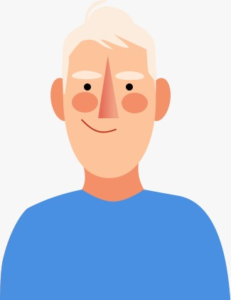

> "Ik weet wel wat ik moet doen op werk, maar mis soms een overzicht van de big picture. Ik denk dat het in ieder geval wel belangrijk is dat je van elkaar weet wat je doet. Volgens mij is dat wel nodig met deze omvang van het bedrijf, om daar het maximale uit te halen."

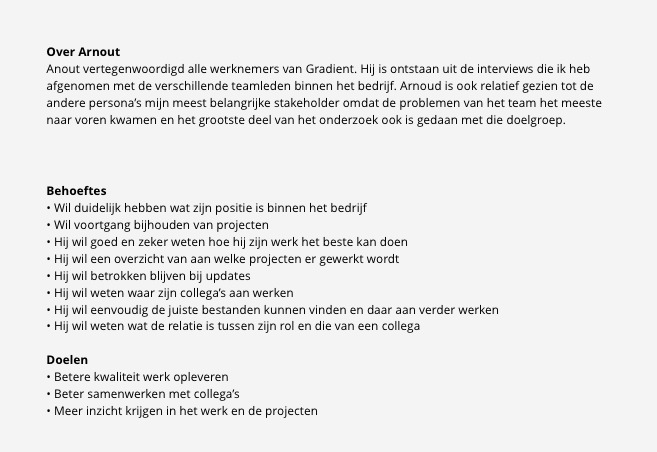



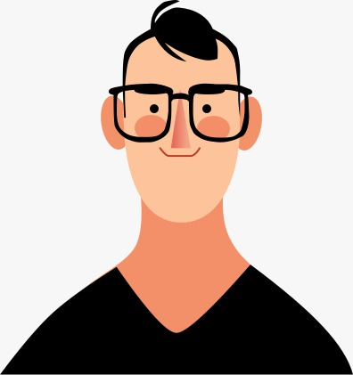

> "Wanneer ik een opportunity zie moet ik in staat zijn om daar snel op de te kunnen anticiperen. Het op de juiste manier communiceren van de core business is key voor een goede presentatie."

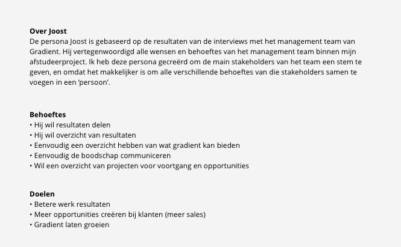



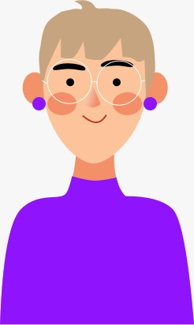

> "We leven in een tijd waarin je digitale strategie steeds belangrijker wordt. Ik wil graag bij de ontwikkelingen blijven net mijn bedrijf en dingen natuurlijk zo snel mogelijk en zo goed mogelijk oplossen"

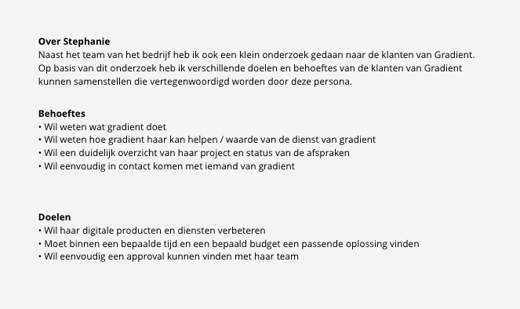



