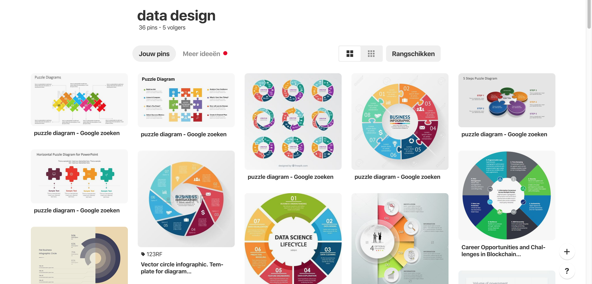
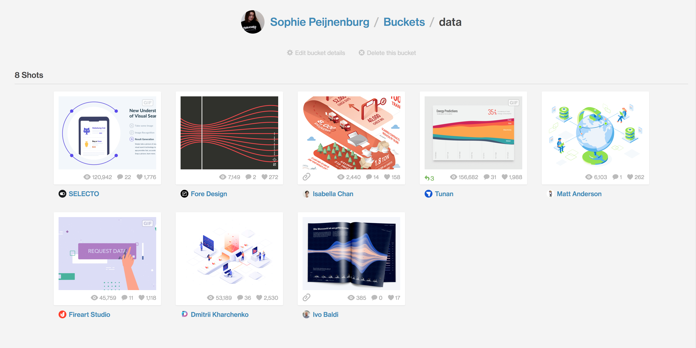
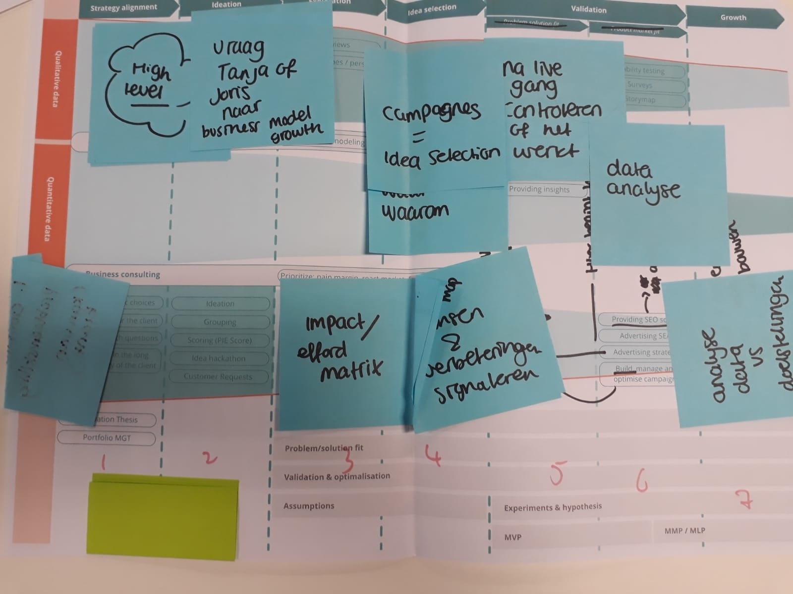
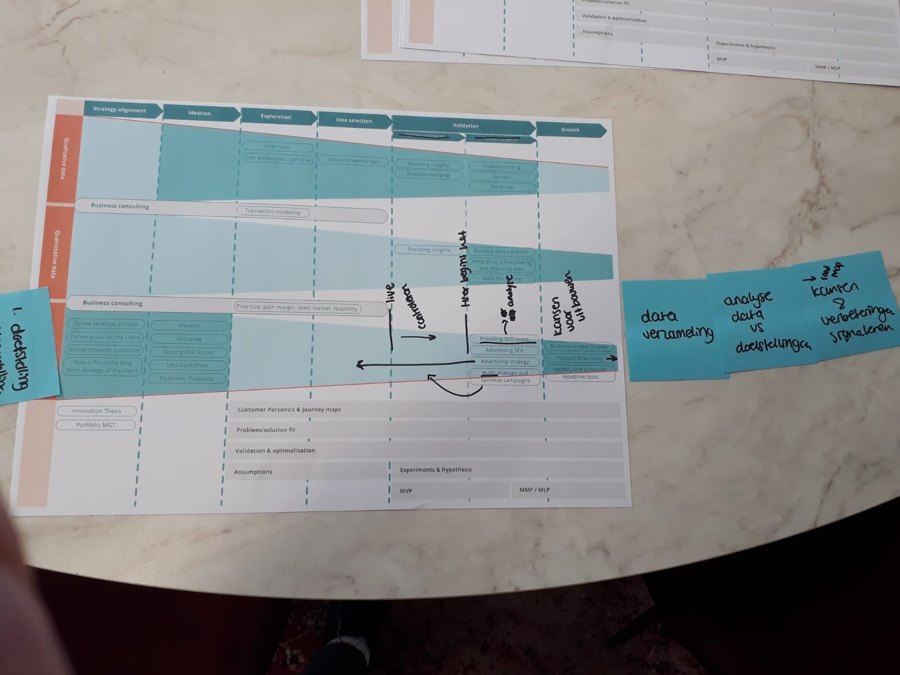
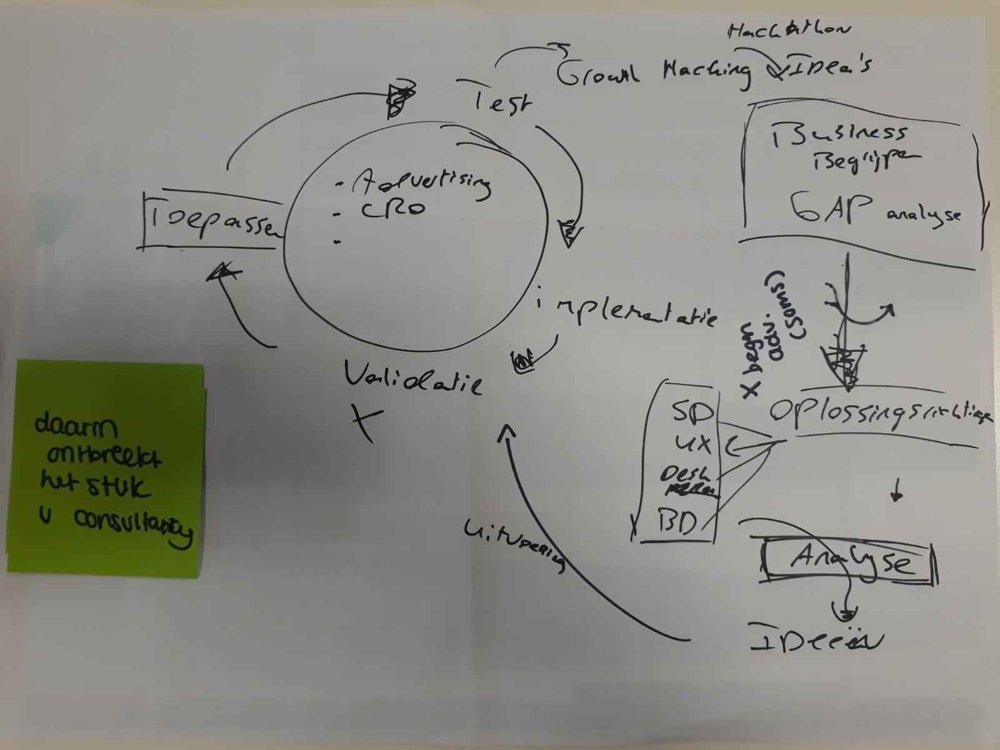
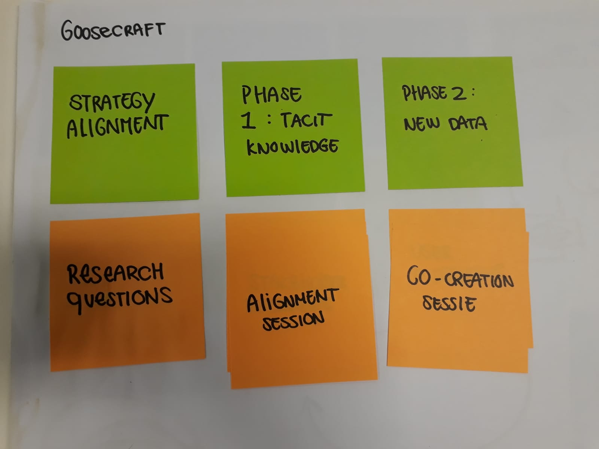
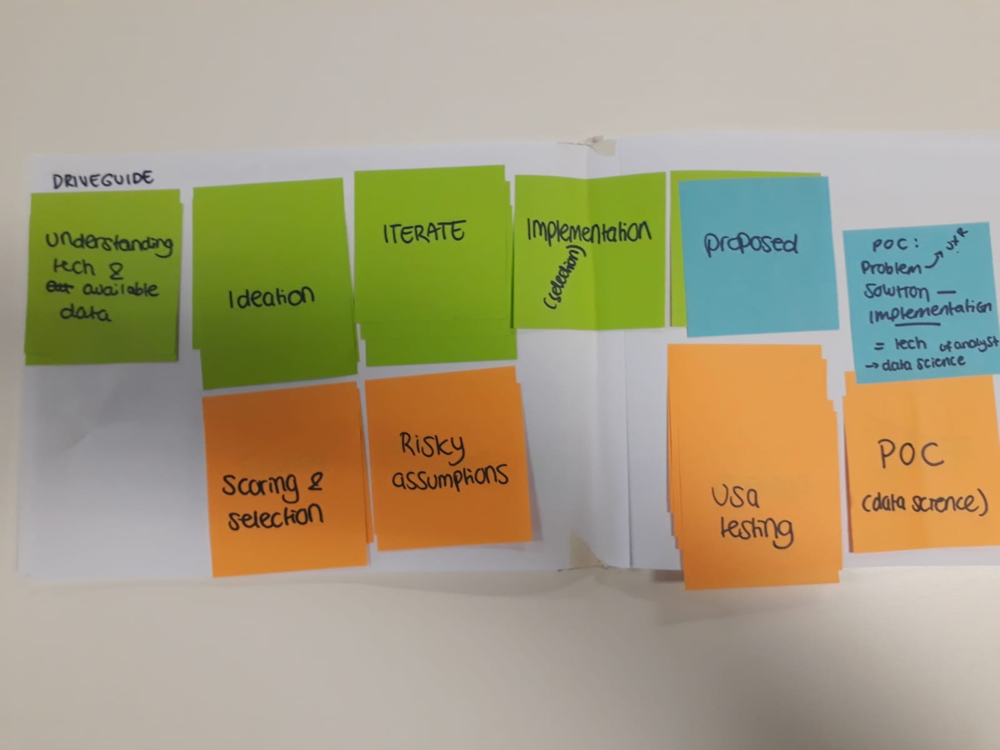
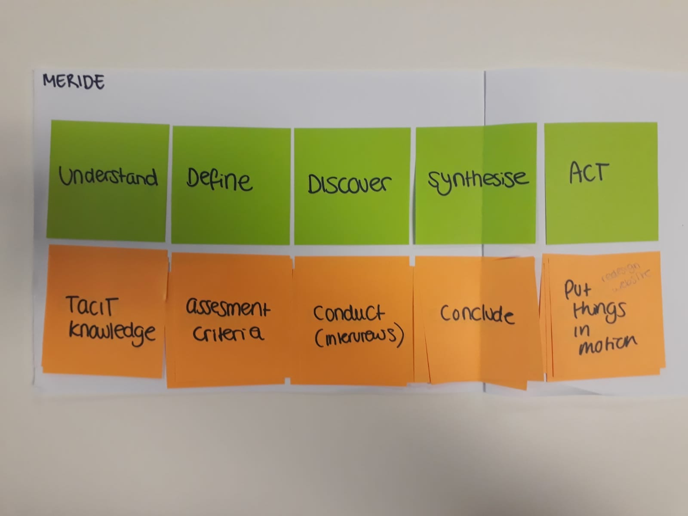
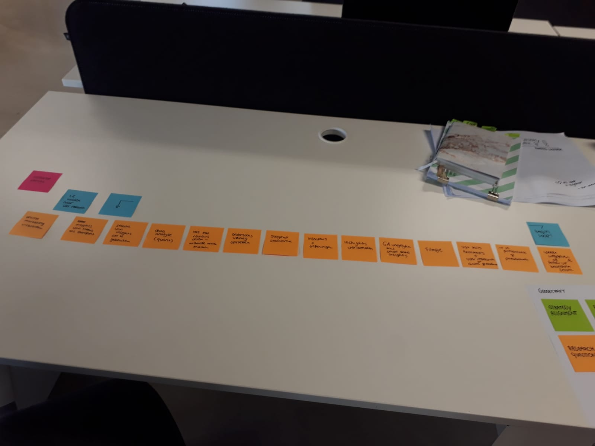
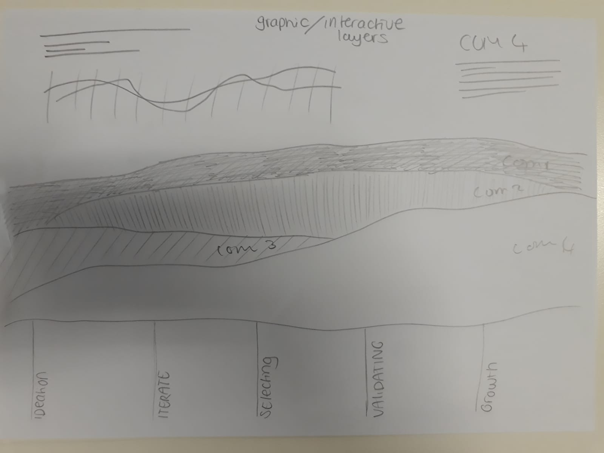

# Ideate

7. Wat is de beste manier om de strategie van Gradient te visualiseren?

8. Welke informatie hebben stakeholders nodig om de strategie van het bedrijf te begrijpen?

9. Ben ik de eerste die dit probleem oplost? 

## Methoden

* Moodboard 
  * Desk research naar andere data visualisatie \(best practices\)
  * Benchmark \(Werner\)
* Participatory design 
* Requirements list 
* 10x vs 10% research -sketchnote
* Research 3 horizons of growth - sketchnote
* Visualisatie 4 
* Visualisatie 5 
* Expert interview \(Dave\) 
* Case study Toolstation
* Case study Meride
* Case study Hema
* Case study inshared
* Case study rody media 
* Case study hema
* feedback frenzy

## Moodboard

Deze moodboards zijn gebruikt om de verschillende mogelijkheden binnen data visualisatie verder te ontdekken en om na te denken over de mogelijke vorm en functies van het product. 

### Benchmark product \(Werner\)



## Participatory design

Om de visualisatie beter bij Gradient te laten aansluiten heb ik verschillende participatory research sessies gehouden met de teamleiders van elk team. Zo heb ik het 'foute' prototype laten zien en samen met hen verbeterd. Deze verbeteringen heb ik meegenomen voor de volgende prototypes.

## Visualisatie werkproces data \(visualisatie 5\)

na aanleiding van de case studies heb ik een van de competenties van Gradient uitgewerkt in een visualisatie waar de samenwerking van de teams meer naar voren komt. Dit als doel om te bedenken hoe het er in combinatie met de andere competenties uit zou zien. 



## Requirements list 



## Case studies 

Na de participatory design werd de flow nog steeds niet echt duidelijker voor mij, waardoor ik heb besloten om case studies te gaan doen. Hierbij bestudeer ik klant cases die Gradient in het verleden al heeft afgerond. Ik let dan vooral op de taken en volgordes van de werkprocessen en welke teams er aan hebben gewerkt. 

Naast desk research heb ik ook een aantal collega's geïnterviewd over de case waar ze aan gewerkt hebben. Zo vroeg ik naar welke fases het project had, wie we betrokken waren en hoe ze het probleem hebben aangepakt. 



## 10x vs 10%

Door de case studies en de participatory design sessies ben ik er achter gekomen dat Gradient twee verschillende soorten projecten draait: 10x en 10%. 

10x kunnen meer gezien worden als innovatieve projecten, het is de bedoeling dat een idee of concept uit het niets \(symbolisch\) 10 keer zo groot wordt. 

10% is meer een groei/scaling project. Hierbij is er al een klant met een bestaand product dat verbeterd moet worden. 10% kan in dit geval gezien worden als een symbolische groei van 10% in sales of aantal clicks bijvoorbeeld. 

Door deze bevinding wist ik wel eindelijk waardoor de vorige iteraties steeds geen goed beeld gaven van Gradient. Ik heb namelijk de fases en werkwijzen van 10x en 10% projecten door elkaar gegooit in een visualisatie. 

vervolgstappen uit deze bevinding was door meer onderzoek te doen naar de verschillende klanten en cases en dit uit te werken in nieuwe prototypes.

## Visualisatie 4 

Na de nieuwe bevindingen te hebben verzameld en samengevat, heb ik opnieuw een poging gewaagd naar de uiteindelijke oplossing. Deze versie van het prototype heb ik laten beoordelen door mede klasgenoten tijdens een feedback Frenzy. 



### Feedback Frenzy

* onduidelijk wat de kleuren betekenen
* onduidelijk wat het tijdsframe is
* ingewikkeld om waar te nemen 
* onduidelijk hoe dit een probleem oplost 
* connectie tussen de oplossing en het problem mist 

## Brainstorm schetsen aan de hand van moodboard

