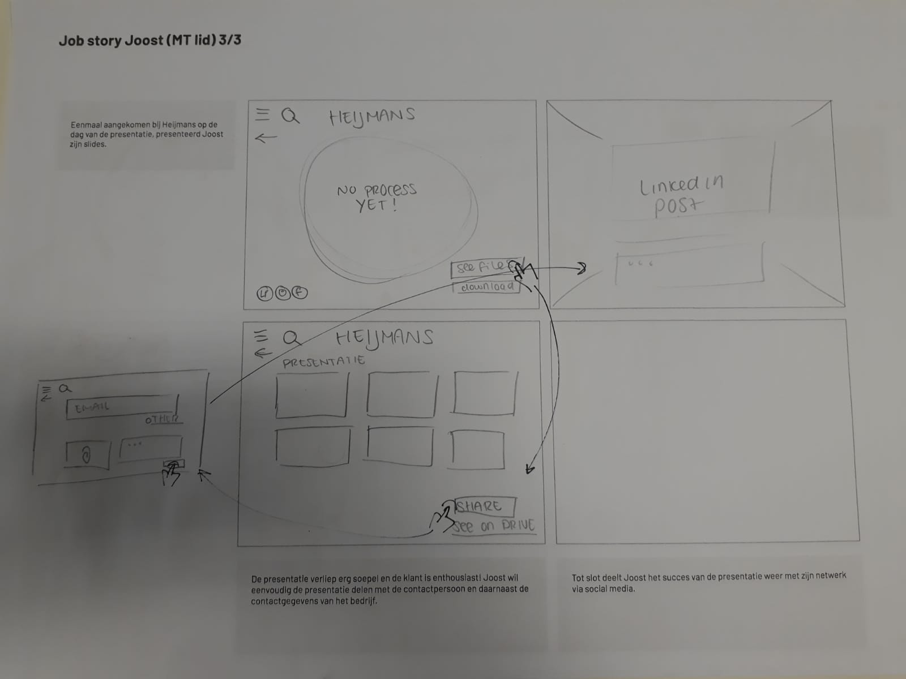
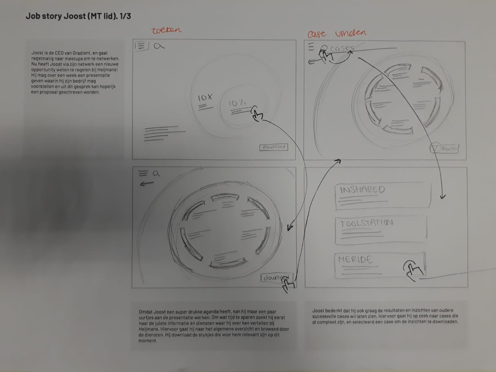

# Prototype

10. Welke methodes bestaan er al die complexe informatie interactief weergeven?

## Methoden

* Concept 1 \(+ prototype, poster\)
*  Concept 2 \(+ prototype, poster\)
* Concept 3 \(+ prototype, poster\)
* Mindmapping
* PIP
* Reverse brainstorming
* What if \(your product was so simple, a child could use it\)
* What if \(everything was connected\)
* What if \(your product got smarter by using it\)
* What if \(you used gamification\)
* Job stories \(klant, ello, joost, dirk\)
* Idea selection

## Concepting

## Concept poster 

## Concept 1

Het eerste concept bestaat uit een interactieve infographic die gekoppeld is aan de huidige website van Gradient. In deze infographic krijgen de gebruikers een overzicht van de kernwerkzaamheden van het bedrijf en hoe de processen in zijn werking gaan. Doormiddel van direct manipulation kan een gebruiker de informatie specifieker of globaler maken en zo de juiste informatie vinden.

## Concept 2

Het tweede concept is gemaakt voor de potentiele klanten van Gradient. Met deze oplossing moet het voor de gebruiker duidelijk worden wat Gradient doet en wat voor waarde het kan toevoegen aan een klant \(of de gebruiker\). De oplossing bestaat uit een website die gekoppeld is aan de huidige website van het bedrijf. De gebruiker kan door het beantwoorden van een aantal vragen zijn eigen rol/toevoeging van het proces vinden en vervolgens kan hij verder zelf zijn eigen journey met Gradient uitmappen. Er komen in de website veel verschillende patterns terug, die gebaseerd zijn op behavioural design. Denk hierbij aan het endowment effect, Ikea effect, foot in the door, suprise effect en limited choise.

## Concept 3

Het derde concept is voornamelijk gemaakt voor de werknemers van Gradient. Het bestaat uit een interactief schema die een live weergave geeft van de kern werkzaamheden van het bedrijf. Dit is gekoppeld aan de cases die Gradient al afgerond heeft, of op dit moment aan werkt. Werknemers kunnen door direct manipulation en door op de juiste knoppen te drukken zelf de juiste informatie vinden over de werkzaamheden van hunzelf, collega’s en projecten.

## Mindmapping

## PIP

## Reverse brainstorming

## What if 

## Job Stories 

### needs jobstories 

## idea selection

In de brainstorm sessies heb ik nagedacht over alle verschillende functies die het product zou kunnen hebben. Vervolgens heb ik de jobstories uitgewerkt door zo veel mogelijk gebruik te maken van de laatste ideeën. Tot slot heb ik uit alle functies alleen de passende geselecteerd voor het uiteindelijke product. 

