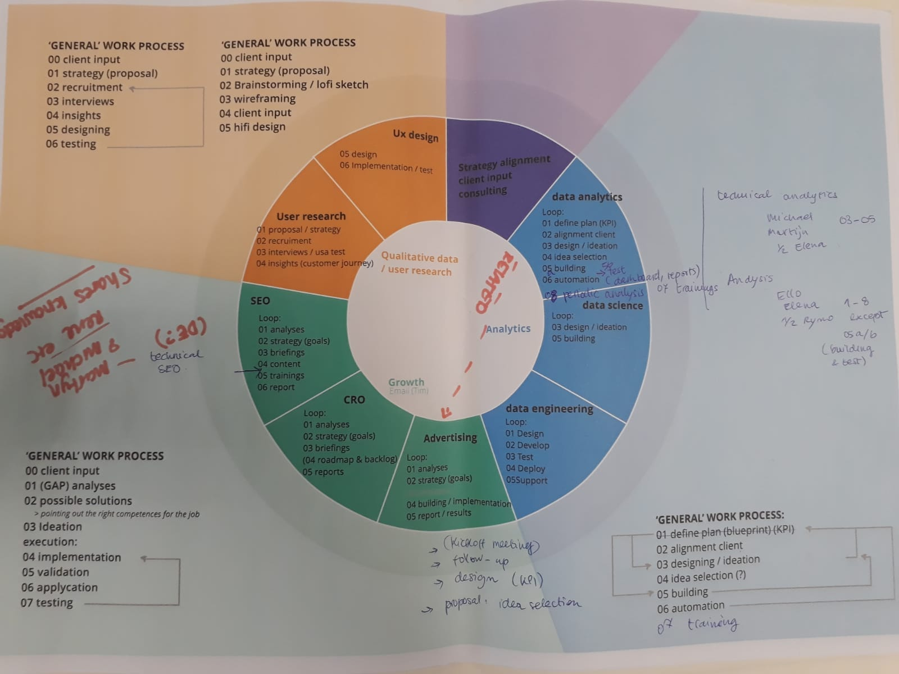
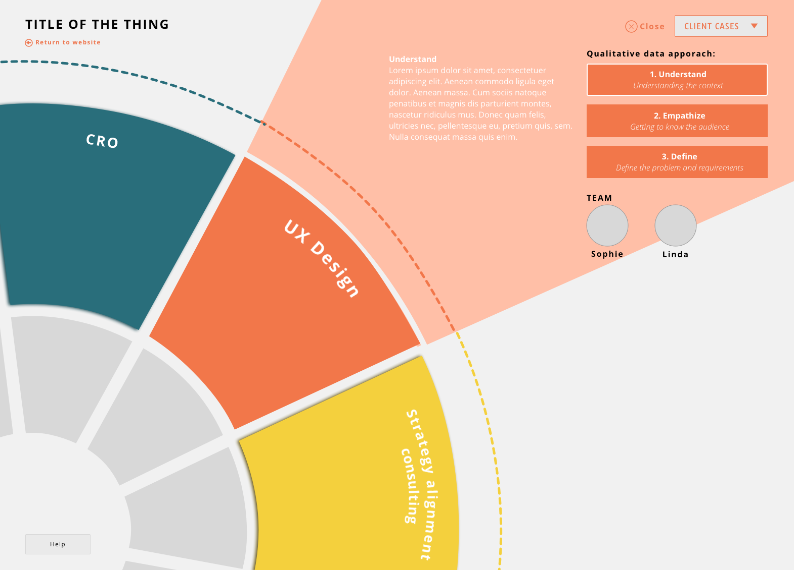

# Test

## Methoden

* Visualisatie 6 \(+ feedback Ryno\)
* Visualisatie 7
* Participatory design \(Ruben, Martijn, Michael, Elena\)
* Visualisatie 8 \(laatste prototype\)
* Product quality review \(Ryno, Parisa\)
* Visualisatie 9 \(laatste prototype verbeterd\)
* Usability test \(Rene\)
* Visualisatie 10
* Usability test \(Ello\)
* Volledige wireflow



## Full journey prototype 1 \(visualisatie 6\)

In dit prototype is een combinatie te zien van de vorige prototypes en de nieuwe bevindingen die ik uit het onderzoek heb gehaald. 



### feedback sessie 

## Full journey prototype 2 \(visualisatie 7\) 











## Participatory design

Versie 5 ben ik op dit moment van het proces nog aan het testen samen met de doelgroep. In deze tests mogen de gebruikers zelf uitleggen wat ze zien en hoe zij denken dat alles werkt en in elkaar zit. Daarnaast mappen we samen hun werkprocessen uit om alles te controleren wat er in de visualisatie staat. 







## Visualisatie 8





## Product quality review \(Ryno en Parisa\)

Aan de hand van mijn nieuwe prototype heb ik samen met mijn opdrachtgevers Ryno \(van het data team\) en Parisa \(UX expert\) een product quality review laten doen waarin zij feedback hebben gegeven op mijn laatste prototype. 

> Parisa: I like the interactions a lot! :\) A reiteration of a comment we discussed in our call as well: 1. making it more visible that user can drag items into the inner circle, 2. what this drag and drop means \(e.g., selecting services\), 3. determining what the next step for users should be \(asking to be contacted by Gradient for a personalised plan?\) Considering making the the dropdown more prominent. Maybe making it bigger, or making each case a separate button, or putting a text next to the dropdown explaining and drawing attention to it. I also suggest putting a "home" option, either separately or as the first option in the dropdown. I know you like animations. What about putting the circle in the middle and having it move to the left when something is chosen from the dropdown?

> Ryno: Strategy alignment & consuling in the only one with an action button? Why here and not the rest? Where would I go if I clicked on that?

> Parisa: Very curious to see how the animations feel. Since there are a lot of them, make sure they are as seamless as possible

> Ryno: Since the 'client cases' dropdown is still there while you are looking at a competency, I think I was expecting the client cases to be filtered on that competency. I.e. if you click on UX, you could only see client cases that include UX \(with some visual indicator for that\), would also be a nice way to cater to the needs of a user who are looking for something particular.

> Ryno: Right now the clickable areas are quite badly aligned with the visuals, but im guessing you know that :\)  When I first clicked on a part, i got confused how to get back. Clicking on the open space didnt work and I was looking for a 'back' button, turned out to be 'close', but a bit too hidden as well.ReplyResolve

> What would the 'help' button do? I think if youve made users need the help button, you will already have lost half of them, no? Maybe an 'about' could work? And have some more generic background there.

> Ryno: Really like the addition of 'team'. Makes it a lot more personal! Maybe even 'meet the team' or something could work

> Ryno: The title here 'orientation' and highlighted step makes me think they are also clickable in the future? Will you have an explenation for all the different steps? Or is a generic description of the process for e.g. technical analytics enough.

> Ryno: Right now I cannot go from one client case directly to another.
>
> Parisa: "View files on Drive" is only visible to internal users, right? What would be the action here for customers?

## Visualisatie 9





## Test Rene 



#### belangrijkste feedback

kan beter:

* oriëntatie van de gebruiker is niet goed op elk scherm 
* inzoomen is onverwacht voor de gebruiker
* bediening is nog redelijk lastig: slechte affordance en hulpknoppen vallen niet genoeg op
* 'return to website' knop is onduidelijk van waar je dan uit komt
* beter om meteen de teams te laten zien ivm met context 
* bijschriften en tekst wordt bijna niet gelezen
* misschien beter om minder details aan klanten te laten zien 
* volgordelijkheid van de teams kan iets abstracter 

goed:

* juiste informatie die wordt weergegeven; geeft een goed beeld van Gradient en wat Gradient doet
* veel mogelijkheid om specifieke details te zien over het bedrijf 
* visueel aantrekkelijk
* sterke focus op de juiste elementen 
* weinig afleiding per scherm, goed minimalistisch ontworpen 
* passend bij elke doelgroep

> Voor klanten kan deze weergave misschien een beetje te holistisch zijn. Hoewel het super goed werkt als inspiratie voor een nieuw project en het echt tot in details correct weergeeft wat Gradient doet, zal een klant denk ik niet zo veel behoefte hebben aan al die details.

## Visualisatie 10

Link naar interactieve versie - final versie getest door Ello:



## Usability test Ello



kan beter: 

* Eerste keer dat het wiel gaat draaien kwam een beetje onverwacht
* menu op het eerste gezicht een beetje onduidelijk omdat het lijkt op een dropdown, maar soms meer werkt als een toggle

goed:

* Informatie klopt
* link naar visuals en knowledge base zou het wat rijker maken
* ideaal als het kan worden doorontwikkeld tot platform wat mensen bij houden
* usability is goed
* goede focus op de juiste elementen 
* duidelijke richtingen in het prototype

> Ik wist niet dat consulting en strategy in de picture hoorden! Wel handig dat het zo is uitgewerkt. 
>
> Het mooiste zou zijn als dit wordt uitgewerkt en gekoppeld aan de website, met links naar drive, als een soort knowledge base.

