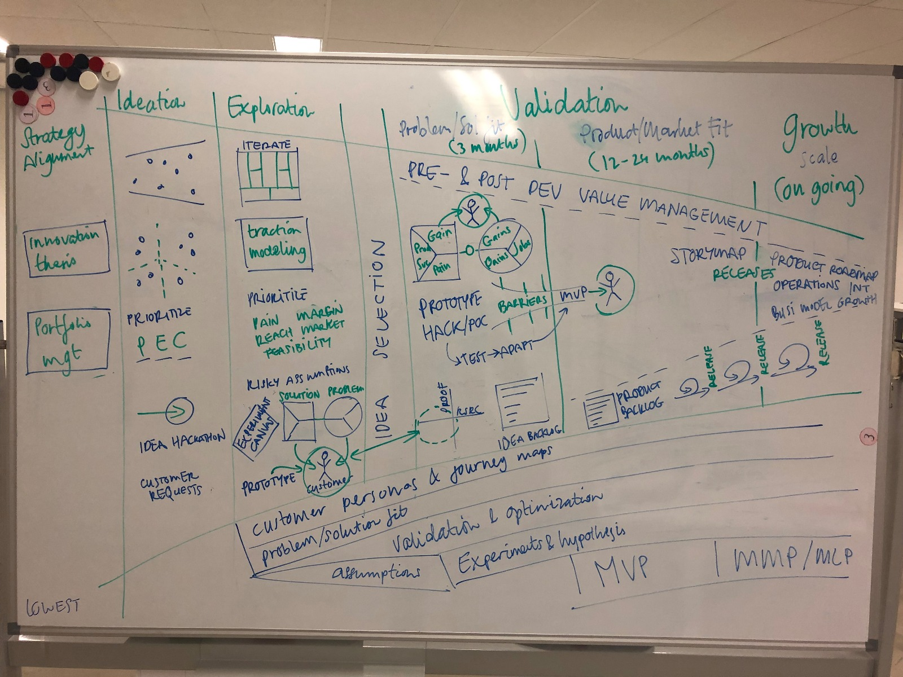

# Understand

#### Onderzoeksvraag

1. Wie is gradient en hoe zit het bedrijf in elkaar?

## Methoden

* **visualisatie 1 \(tekening ties\)**
* **Desk research naar gebruikte methoden: AAARR, Hook model, BJ Foggs’ behavioural model, design thinking, data maturity model, growth hacking methodology**

Gradient is in 2012 opgericht onder de naam ConversionMob en is gespecialiseerd in datagedreven SEA en SEO. Echter veranderde de markt en dekte deze competenties de lading niet meer \[Joost Jongbloed, \[bron: https://www.emerce.nl/nieuws/nieuwe-naam-directie-conversionmob\]. Inmiddels is de propositie veranderd naar het verbeteren van digitale producten en diensten door de customer experience te versterken. 

“We ontwikkelen technologie, zoals algoritmes, scripting, tooling, voor marketing automation. Alles op basis van die consumenteninzichten. In feite is het een samenkomst van designthinking en datawetenschap. En de uitkomsten passen we toe binnen digitale marketing. Advertising is hierbij niet per se het einddoel, de vraagstukken liggen vaak breder.” - Joost Jongbloed

Gradient werkt voor bedrijven als McDonalds, InShared, HEMA, BVA Auctions, WE fashion en Achmea.



## Tekening

Mijn opdracht is begonnen met een eerste whiteboard tekening die gemaakt is door mijn opdrachtgever. Hij probeerde de diensten van Gradient in een schema weer te geven, en daarbij een combinatie te maken met de methodes en opleveringen die bij elk project horen. 

## Desk research + prototype 1 

Na aanleiding van de eerste tekening heb ik onderzoek gedaan naar de methodes van Gradient en hoe deze worden ingezet bij klanten. Met de inzichten uit het desk research heb ik deze eerste visualisatie gemaakt. 



